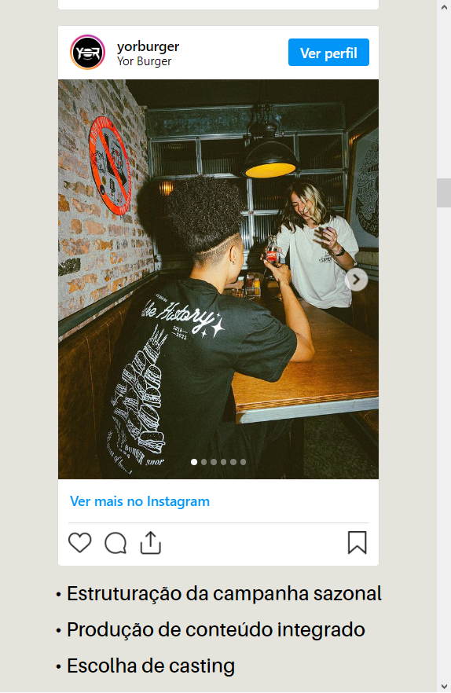

# Portfolio - Manuella Camargo

Página de exposição do portfolio da especialista em marketing estratégico e inovação [Manuella Camargo](https://www.instagram.com/manuucamargoo/)

&nbsp;

## Índice
- <a href="#funcionalidades-do-projeto">Funcionalidades do Projeto</a>
- <a href="#layout">Layout</a>
- <a href="#demonstração">Demonstração</a>
- <a href="#tecnologias-utilizadas">Tecnologias Utilizadas</a>
- <a href="#pessoas-autoras">Pessoas Autoras</a>

&nbsp;

## Funcionalidades do Projeto

- [x] Exposição de projetos visuais e descrição de conceitos usados em cases e campanhas.
- [x] Elementos do instagram incoporados na página.

&nbsp;

## Layout

### Desktop

### Tablets

### Mobile

&nbsp;

## Demonstração

[Url da Página](https://portfolio-manuella-camargo.vercel.app)

&nbsp;

## Tecnologias Utilizadas

1. [HTML](https://www.w3.org/html/)
2. [CSS](https://www.css3.com)

&nbsp;

## Pessoas Autoras

### João Pedro O. Nunes
[LinkedIn](https://www.linkedin.com/in/joão-pedro-de-oliveira-nunes-0b5276195/)   
[GitHub](https://github.com/40jope)

### Manuella Camargo
[LinkedIn](https://www.linkedin.com/in/manuella-camargo-522b3724a/)  
[Instragram](https://www.instagram.com/manuucamargoo/)

---
